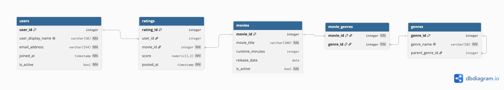

# ex603-movie-tv-database

Name: Jonathan Kahng  
Purpose: Repository to be used for EX 603 Data and Algorithms for Scalable Systems (Fall 2026)  
Theme: Movies / TV  
What This System Does: TBD  

# Reelist

A relational database and analytics layer for a film and television rating platform, built across the seven units of EX603.

**Theme:** Movie / TV

---

## Domain

Reelist is a catalog-and-rating platform in the mold of Letterboxd or IMDb. Users browse a library of films and television titles, watch them elsewhere, and return to the platform to leave a numeric score. Each title belongs to one or more genres, and those genre associations are what let the platform group, filter, and recommend across an otherwise flat catalog. The platform does not stream anything itself. Its entire value is the rating data its users generate and the structure imposed on that data by the catalog.

The core tension in the model is that ratings arrive continuously and in volume, while the entities being rated change slowly. A title is added once and edited rarely. A genre list is nearly static. But `ratings` grows without bound, one row per user-title pair, each carrying a score and a timestamp. That asymmetry drives most of the design decisions in this project: `ratings` is the fact table, and `users`, `movies`, and `genres` are dimensions that exist to give those facts meaning. The many-to-many link between titles and genres needs its own junction table, since a film can be both a thriller and a comedy and neither attribute is subordinate to the other.

The questions the platform must answer fall into three tiers. The simplest are lookups and filters: which titles were released in a given window, which are currently active in the catalog, which users have rated anything at all. The middle tier requires aggregation across the rating table: what is a title's average score, how many ratings does it have, which genres draw the highest scores, and how do those answers change once you exclude titles with too few ratings to be meaningful. The hardest tier requires ordering and comparison within groups: how a title's score trends over time as more users weigh in, where a title ranks against others in the same genre, and how an individual user's scoring behavior compares to the platform average. That last tier is what makes window functions necessary rather than optional, and it is the reason the `ratings` table carries a timestamp rather than just a score.

---

## Entity-Relationship Diagram

Editable source: [`schema/erd.dbml`](schema/erd.dbml)

---

## Repository Structure

| Path | Contents |
|---|---|
| `schema/` | DDL script, ERD image and source, relation schemas, constraint justifications |
| `queries/` | One subfolder per unit (`unit3`–`unit6`), holding that assignment's `.sql` files |
| `analysis/` | Written notes and reflections, one markdown file per unit |
| `screenshots/` | Execution evidence, named to map to the task it supports |
